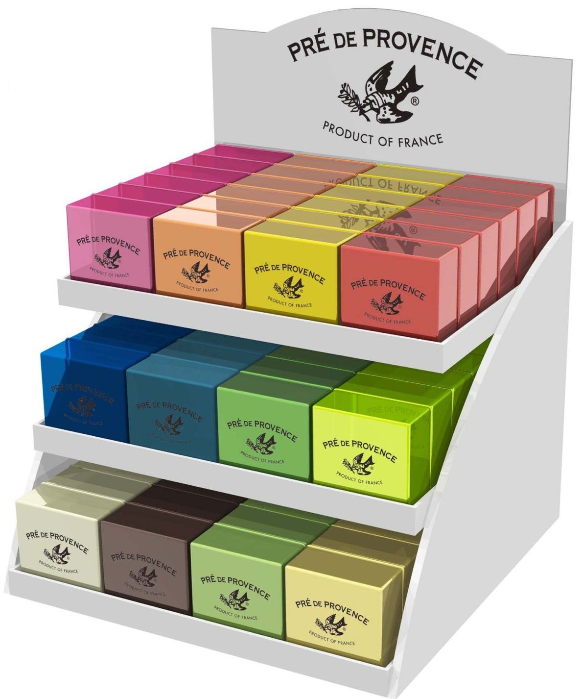
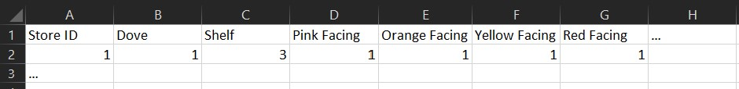
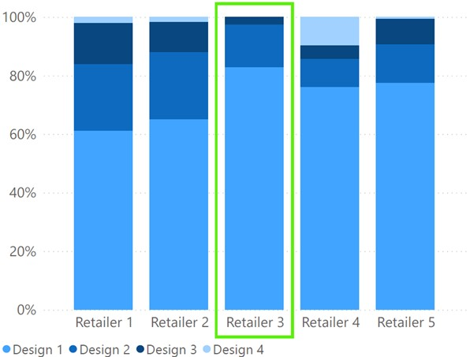
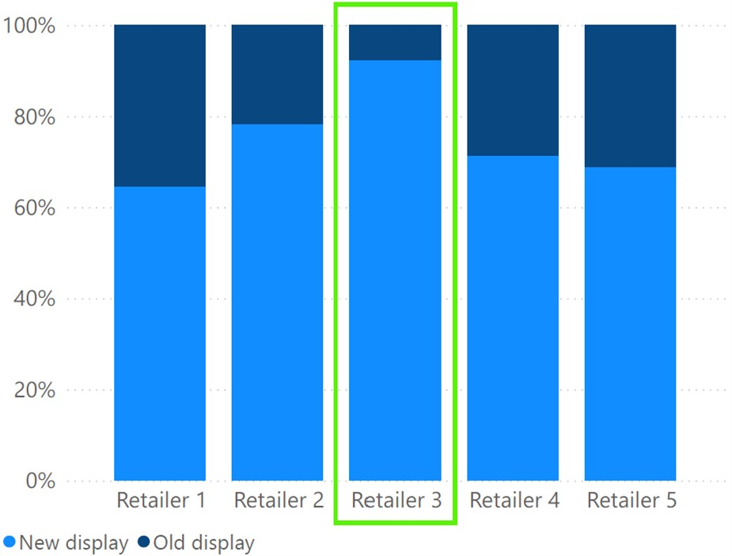
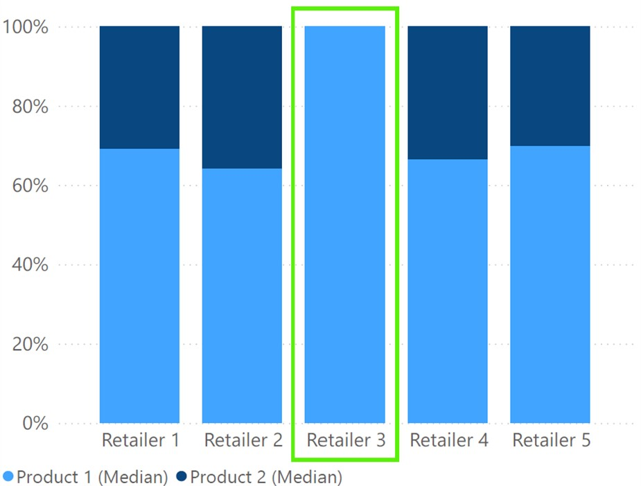
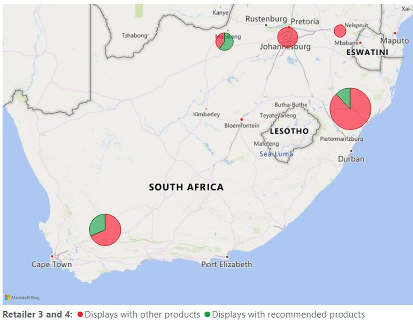
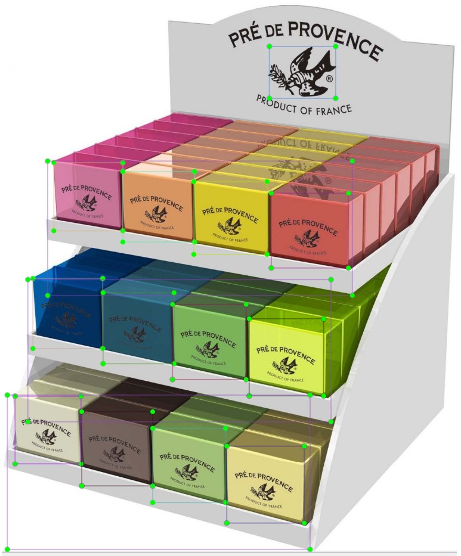

# Product Display Optimization

## Description
This is my capstone project for a data science bootcamp (The Data Incubator). It detects product facings, design features of displays and shelves in images of displays, counts them and saves the counts with the store ID to an excel file. More specifically, it turns an image like

into

The project follows the TensorFlow Object Detection API Tutorial. The GitHub repository does not include images and labelling. To train the model on a different set of images, include them in the TensorFlow images folder and annotate them as explained in the TensorFlow tutorial.

In addition, the project adds information about the location of the displays using the Google Maps API.

## Purpose of the Project

My project analyzes product displays of a particular promotion for a specific brand (not Pré de Provence). The aim is to answer the following questions:

* Where the correct displays put up for the specific promotion?
* Where the old displays replaced by the new ones?
* Where the displays correctly stacked?

## Results

This section is to demonstrate what sort of insights we can generate from the spreadsheet. Note that all the results are specific to my data set.

First, I analyze how many of which displays were put up by the different retailers. Each type of display is characterized by a distinct design feature. The correct design for this promotion is Design 1.

Insight 1: Retailer 3 - that uses a different display assembly service - put up more of the correct displays.

Second, I analyze how many new displays relative to old displays were put up by the different retailers. New displays arrange design features differently, which is how I identify new and old displays.

Insight 2: Retailer 3 - that uses a different display assembly service - put up more new displays.

Third, I analyze how many facings product 1 has on a typical shelf compared to facings of product 2. Product 1 and product 2 are the two products that were supposed to be on display.

Insight 3: Retailer 3 - that invests more into shelf optimization - displays only one of the products.

Fourth, I analyze how many displays include other products in the different provinces of South Africa. The size of the bubbles correspond to the number of images taken in the respective province.

Insight 4: Retailer 3 and 4 included other products on almost all displays in the two largest markets (Gauteng and KwaZulu-Natal).

Insight 5: The fieldforce failed to collect images of displays in Gauteng.

## Annotation

I annotate the data myself with LabelImg making sure that...

* ... the bounding boxes contain the entire object and are tight.
* ... occluded objects are labelled including the occluded part.
* ... all objects in the images are labelled.

## Relabelling of Annotation
I use this repo for different purposes. I have a script that relabels the train and test data (relabel_train.ipynb) as well as a script that relabels the data for analysis (relabel_analysis.ipynb). The relation between original and new labels are saved in npy-files.

## Annotation Check
The script annotation_check.ipynb checks whether all images have been labelled and plots a random sample of images with annotation.

## Object Detection
The script main.ipynb follows the TensorFlow Object Detection API Tutorial. The script tensorflow_to_excel.ipynb loads the model and detects products, design features of displays and shelves. The detected objects are saved in an excel-file.

## Location
The script geo_info.ipynb looks up store location information using an excel table with additional information about the images. I add the address, longitude and latitude to the excel-file with image information using the Google Maps API. In addition, I extract the ZIP code from the address in order to determine the province in which the store is located.

## Display Analysis
The script display_analysis.ipynb analyzes a particular set of displays. I look at the differences in the types of displays that different retailers set up during the same promotion. I also checked how different retailers typically stacked the displays. More specifically, I checked the number of facings of two specific products and how many shelves were empty or used for other products.
